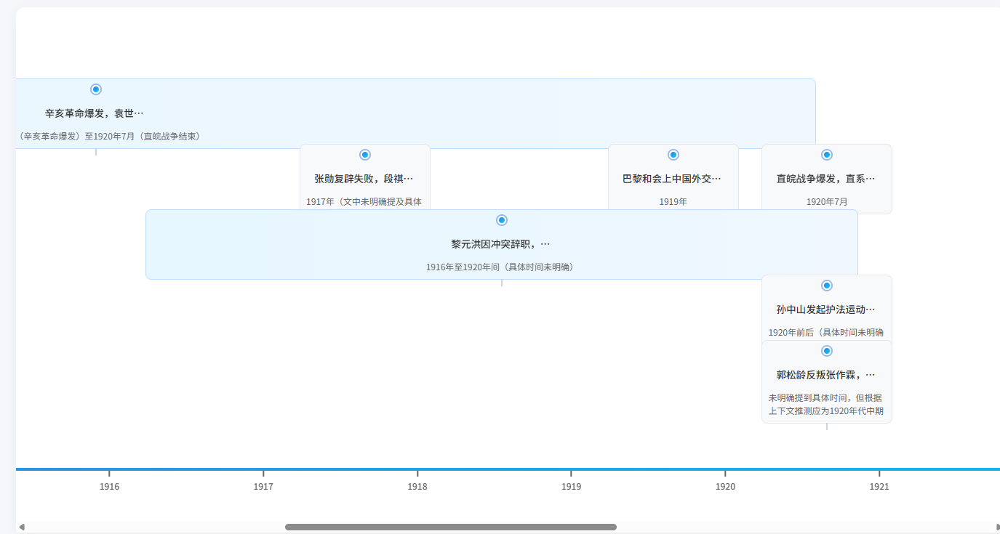

# ChronoLink

> 智能历史知识整理助手 - 将碎片化历史知识转化为结构化、可视化的时间线。与AI探讨历史

## 🚀 项目亮点

- **智能提取**：基于大语言模型的文本理解技术，从文档和视频中自动提取历史事件、人物和思想，

- **事件关联**：体现历史事件之间的关联性
  
- **时间轴可视化**：创新的交互式时间轴设计，支持历史事件的事件详情流畅浏览
  
- **智能问答**：基于RAG技术的问答系统，深度全面地回答用户问题

## 🌐 在线体验

[立即访问](http://118.31.113.30:1112/)  
测试账号：test_demo / test

## 📸 界面截图

### 时间轴界面

### 知识提取

### 智能问答

## 🎯 项目背景

历史知识常以零散的形式存在于文档和视频中，难以形成系统化的理解。ChronoLink通过AI技术自动化提取和组织历史知识，将文本转化为清晰的时间线图谱，帮助用户直观理解历史事件的因果关系和时间脉络。

## ⚙️ 核心技术实现

### 数据库设计

- 采用Lancedb存储事件总结、时间、人物思想及事件关系等关键信息，同时支持文本片段检索，满足时间轴构建和问答系统的需求。
- 高效检索：优化查询算法，确保快速检索和精准匹配。

### 智能信息提取系统

- 大语言模型驱动：基于LLM的文本理解和实体识别技术，精准提取历史事件和关键信息。
- 事件去重算法：自动检测重复事件，确保信息的唯一性和准确性。
- 时间标准化：支持时间表述的标准化

#### 流程图

### 问答系统

- 自研RAG技术：结合类似“thinking模型”的问题拆解与检索机制，逐步解析复杂问题。
- 多工具协同：集成多种搜索工具，模型可自主选择最佳工具，突破传统向量搜索的局限性。
- Agentic-RAG框架：通过分步回答和答案关联性分析，生成全面且逻辑清晰的综合回答。

#### 流程图

### 时间轴可视化

- 自适应交互式设计：基于原生JavaScript和CSS实现动态时间轴渲染，支持多设备适配。
- 智能布局算法：自动优化事件时间范围的布局，避免重叠并提升可读性。
- 多行事件展示：优化大跨度历史事件的可视化效果，支持复杂时间线的清晰呈现。
- 事件关联网络：通过可视化网络展示历史事件的因果关系，帮助用户理解事件间的深层联系。

